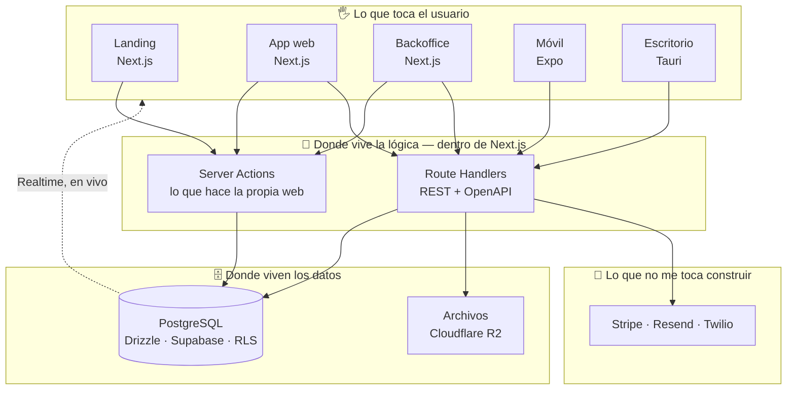

<div align="center">

# 🧱 Mi stack

**Con esto construyo apps web, móviles y de escritorio.**

TypeScript de arriba a abajo, Postgres abajo del todo.

<br/>


<br/>

*Esto es mi punto de partida por defecto, no un dogma.*
*Salirse está permitido.*

</div>

---

## 🗺️ Arquitectura

Casi todo lo que construyo cabe aquí. **Sin backend aparte**: la lógica de servidor vive dentro de Next.js y la base de datos hace su parte.



---

## 🤖 Planeación


**Claude Code** como agente y **SDD (Spec-Driven Development)** como método: primero se escribe la especificación, después el código. Suena lento y es exactamente al revés — el agente escribe mucho más rápido de lo que yo reviso, así que el cuello de botella es tener claro qué se quiere antes de que existan 400 líneas.

El andamiaje de IA es parte del repo, no algo de cada quien:

| Archivo | Para qué |
|---|---|
| **`CLAUDE.md`** | Arquitectura, comandos y reglas del proyecto. Es lo que evita que la IA proponga cosas fuera del stack. |
| **`.claude/skills/`** | Lo repetitivo escrito una sola vez: crear un módulo, agregar una migración, preparar un release. |
| **`.claude/settings.json`** | Hooks y permisos, iguales para todo el equipo. |
| **`.mcp.json`** | Los MCP versionados: Figma, Supabase, Sentry, Stripe, Playwright, GitHub, Context7. |

> **Reglas duras que van sí o sí en `CLAUDE.md`:** nunca tocar migraciones ya aplicadas, nunca commitear secretos, siempre validar con Zod en los bordes.

---

## 🗣️ Lenguaje


**TypeScript en modo estricto.** Sin `any` implícito.

**Zod valida todo lo que cruza una frontera**: formularios, respuestas de API, variables de entorno, webhooks. Los esquemas viven en `packages/shared` y un mismo esquema es tres cosas a la vez: la validación, el tipo (`z.infer`) y el OpenAPI que consumen los clientes. Se escribe una vez.

---

## 👀 Frontend y UIS


Son cinco superficies y todas comparten los mismos tipos, los mismos tokens de diseño y el mismo contrato de datos.

| Superficie | Qué es | Con qué |
|---|---|---|
| 🛬 **Landing** | Lo público: qué es el producto, precios, blog, SEO. | Next.js estático (SSG) |
| 💻 **App web** | El producto de verdad, después del login. | Next.js (App Router) |
| 🎛️ **Backoffice** | El panel interno: soporte, métricas, cuentas. | Next.js (App Router) |
| 📱 **Móvil** | iOS y Android para el cliente final. | React Native + Expo |
| 🖥️ **Escritorio** | Cuando el producto tiene que vivir en la máquina. | Tauri v2 |

**Estilos:** Tailwind + shadcn/ui en web, Tailwind vía NativeWind en móvil.

---

## 🧠 Estado en el cliente


TanStack Query se encarga de caché, reintentos, invalidación y estados de carga — igual en web que en Expo. Zustand para lo del frontend y nada más: tema, filtros, el wizard abierto. Nunca datos que ya son del servidor.

> **Si el dato tiene dueño en la base de datos, es de TanStack Query.**
> **Si solo existe mientras la pantalla está abierta, es de Zustand o `useState`.**

---

## 🤝 Contrato API


|  | Para quién |
|---|---|
| **Server Actions** | Formularios y mutaciones de las apps web. Función tipada, sin endpoint que mantener. |
| **REST + OpenAPI** | Móvil, escritorio, integraciones, clientes externos y dispositivos IoT. |

El OpenAPI **se genera desde los mismos esquemas Zod**. No se escriben tipos de API a mano.

---

## 🗄️ Los datos


**PostgreSQL + Drizzle ORM**. Drizzle da tipado completo desde el esquema y genera SQL predecible, sin sorpresas de rendimiento en queries complejas.

**Supabase** hospeda y administra, y trae Auth, Storage y Realtime. Por debajo es Postgres, el día que haga falta mover la base a un VPS, el esquema y el SQL se van tal cual.

### 🔐 Auth

**Supabase Auth**: email + contraseña, magic links y OAuth con Google y Apple — *Apple es obligatorio* si hay login social en iOS. En Expo la sesión se guarda en `expo-secure-store`, nunca en AsyncStorage plano.

**El backoffice usa el mismo proveedor pero otro modelo de permisos**: políticas propias y **2FA obligatorio** para cualquier cuenta que toque datos de clientes.

Cuando llegue un cliente enterprise pidiendo "que mis empleados entren con el Microsoft de la empresa": SSO con SAML/OIDC, SCIM para aprovisionar usuarios y log de auditoría.

### ⚡ En tiempo real

**Supabase Realtime.** La UI se suscribe a los cambios de Postgres por WebSocket y se actualiza sola. Alcanza de sobra para dashboards en vivo, notificaciones, presencia, chat y telemetría de baja frecuencia.

Si aparecen miles de dispositivos conectados o escrituras sub-segundo, ahí sí toca **MQTT** (EMQX o Mosquitto) como broker, **Redis** de buffer y **TimescaleDB** para las series de tiempo. Realtime se queda igual para el frontend: MQTT alimenta la base, la base alimenta la UI.

---

## 🔌 Servicios de terceros


| Qué | Con qué | Por qué ese |
|---|---|---|
| 💳 **Pagos** | Stripe | Webhooks con firma verificada, siempre. |
| ✉️ **Email** | Resend | API limpia, plantillas en React. |
| 💬 **SMS / WhatsApp** | Twilio | Cobertura y entregabilidad sin pelear con operadores. |
| 📦 **Archivos** | Cloudflare R2 · *alt:* Supabase Storage | R2 **no cobra egreso**, y esa es la diferencia grande. Supabase Storage si el volumen es bajo y prefieres una dependencia menos. |

---

## 🧰 La caja de herramientas


Todo en un **monorepo con Turborepo + pnpm**. Las apps comparten tipos sin publicar paquetes npm privados ni abrir dos PRs por cada cambio de contrato.

```
proyecto/
├─ apps/
│  ├─ landing/      # Next.js estático
│  ├─ app/          # Next.js — clientes
│  ├─ backoffice/   # Next.js — interno
│  ├─ mobile/       # Expo
│  └─ desktop/      # Tauri
└─ packages/
   ├─ shared/       # tipos, esquemas Zod, utilidades puras
   ├─ db/           # esquema Drizzle y migraciones
   ├─ ui/           # tokens de diseño, componentes, config de Tailwind
   ├─ api-client/   # cliente REST tipado, generado desde OpenAPI
   └─ config/       # tsconfig, biome, presets
```

**Testing:** Vitest para unitarios e integración, Testing Library para componentes, Playwright para los flujos críticos en web. `tsc --noEmit` en CI como puerta de calidad. Cuando escale: k6 para carga y Maestro para E2E en móvil.

**Lint y formato:** Biome. Hace lo de ESLint y Prettier en una sola herramienta y órdenes de magnitud más rápido.

---

## 📤 Dónde vive


**Vercel + Supabase Cloud**, y cero operación: deploys con cada push, CDN global, preview por rama. Las tres webs son tres proyectos apuntando al mismo repo. El backoffice además se protege a nivel de plataforma (IP o Vercel Authentication) — no basta con que sea "otra URL con login".

**En CI, al inicio:** Vercel desplegando solo, EAS Build cuando toca release, EAS Update para el JS de por medio, y checks de `typecheck` + `biome` + `vitest` al abrir PR, con los filtros de Turborepo para correr solo lo que cambió.

**Cuando el negocio ya depende de la app:** GitHub Actions como pipeline único, builds móviles automáticos a TestFlight e internal track, migraciones aplicadas desde el pipeline (nunca a mano) y un staging de verdad con su propia base y sus propias claves.

**El plan B: Docker + VPS.** Next.js en modo `standalone`, Caddy o Traefik de proxy con TLS automático, Postgres en contenedor con backups **verificados** — un backup sin restore probado no es un backup. Hetzner, DigitalOcean o infraestructura propia.

> 🧭 **Regla de portabilidad:** el proyecto debe poder desplegarse en los dos desde el día uno. Nada de APIs exclusivas de Vercel dentro de la lógica de negocio.

> 🚫 El procesamiento pesado y las cargas de GPU **nunca** van en funciones serverless. Los límites de tiempo y memoria no dan. Van en contenedores dedicados, invocados por cola.

---

## ⏳ Caché y trabajos programados

**Caché, gratis y sin infraestructura:** la caché nativa de Next.js (`revalidate`, `unstable_cache`, ISR), el CDN de Vercel y TanStack Query en el cliente. **Cubre bastante más de lo que la gente asume.**

Redis entra cuando pasa alguna de estas: queries lentas que se repiten mucho, rate limiting de verdad (contadores compartidos entre instancias), trabajos en segundo plano con reintentos, o invalidación de caché desde varios productos a la vez.

**Cron, gratis:**

| Herramienta | Para qué |
|---|---|
| **Vercel Cron** | Tareas HTTP: reportes diarios, limpieza, sincronizaciones. |
| **pg_cron** (Supabase) | Lo que es puro SQL: purgar registros viejos, refrescar vistas materializadas, agregar métricas. Corre dentro de la base, sin red de por medio. |

**Cuando los trabajos crecen:** QStash para cola por HTTP con reintentos, o Inngest / Trigger.dev si son flujos largos de varios pasos con visibilidad por ejecución.

> 🔔 **La señal para dejar de improvisar:** cuando un trabajo que falla sin reintento automático empiece a costar dinero o soporte, ya necesitas cola real.

---

## 🛡️ Seguridad y Observabilidad

<summary><b>Seguridad</b> — lo que va desde el día uno</summary>

<br/>

- **RLS activo en todas las tablas.** Una tabla sin política es una tabla pública.
- Todo input validado con Zod en el servidor, **Server Actions incluidas**.
- Variables de entorno validadas al arrancar: que falle en el build, no en producción.
- La `service_role` key de Supabase **jamás** sale del servidor.
- Headers de seguridad en Next.js: CSP, HSTS, `X-Frame-Options`, `Referrer-Policy`.
- CORS restringido a dominios conocidos y rate limiting en auth y endpoints públicos.
- Firma verificada en **todos** los webhooks entrantes.
- Backoffice: 2FA obligatorio, sesión corta y log de cada acción sobre datos de clientes.
- Secretos en el gestor de cada plataforma (Vercel, EAS Secrets, Docker secrets). **Nunca en el repo**, nunca en bundles de cliente.
- Dependabot o Renovate para los parches automáticos.

**Al escalar:** Cloudflare WAF delante, log de auditoría (carísimo de agregar después, porque hay que reconstruir historia), rotación centralizada de secretos con Doppler o Infisical, pentest antes de certificaciones, y GDPR / habeas data: exportación y borrado de datos, retención definida, consentimiento de cookies.

<summary><b>Observabilidad</b> — enterarte tú antes que el cliente</summary>

<br/>

- **Sentry** para errores y crashes, con alertas a Slack y un proyecto por superficie. Un error del backoffice no puede perderse en el ruido de la app pública.
- **PostHog** para comportamiento de producto.
- **Pino** para logs estructurados en JSON con `requestId` correlacionado. Nunca `console.log` en producción, y nunca datos personales ni tokens en los logs.
- **Uptime externo** (BetterStack o UptimeRobot, tier gratuito).

**Al escalar:** OpenTelemetry cuando haya más de un servicio, logs centralizados y buscables, dashboards de métricas de negocio (no solo técnicas) y alertas con on-call definido.

---
<br/>

<div align="center">

# Para cuando es necesario un backend dedicado

</div>

Para cuando meter la lógica dentro de Next.js deja de tener sentido. Agregar un **backend dedicado** cuando:

> 📱 La app móvil es el cliente principal · ⏱️ Procesos que superan el límite de serverless · 🔌 Hace falta conexión persistente (WebSocket propio, MQTT, workers) · 🏢 Un tercero va a consumir la API · 📐 La lógica dejó de ser CRUD · 👥 Más de un desarrollador backend · 💸 Trabajos en cola que fallan y cuestan dinero

Y hay productos que nacen aquí directamente: plataformas IoT con ingesta de telemetría, productos donde la app móvil *es* el producto, sistemas con GPU desde el día uno, o proyectos donde el cliente exige la API como entregable.

### ➕ Lo que se agrega


- **`apps/api` con NestJS**, un módulo por dominio de negocio. Guards, interceptores y pipes.
- **`apps/worker`**, proceso aparte que consume las colas. Separado a propósito: un job pesado no puede degradar la latencia de la API, y cada uno escala por su lado.
- **Redis deja de ser opcional y pasa a ser infraestructura base**: caché, colas, rate limiting, locks e idempotencia.
- **BullMQ** con colas por tipo de trabajo, reintentos con backoff exponencial y **dead-letter queue** revisable desde el backoffice con Bull Board.
- **`@nestjs/config` + Zod** validando el entorno al arrancar: si falta una variable, el proceso no levanta.
- **`@nestjs/terminus`** con `/health/live` y `/health/ready`, que es lo que los orquestadores necesitan para no enrutar tráfico a un contenedor que aún no está listo.
- **`@nestjs/throttler` sobre Redis**: rate limiting por endpoint y por rol.
- **Docker + docker-compose** para levantar Postgres, Redis, API y worker en un comando.
- **Staging real**: su propio proyecto de Supabase, su propia Redis, su propia API.
- **OpenTelemetry**, porque ya hay más de un servicio y una petición tiene que poder seguirse desde el clic hasta el job en la cola.
- **Log de auditoría** en tabla propia — barato ahora, porque todo pasa por el mismo interceptor.
- **Secretos centralizados** (Doppler o Infisical): con cinco entornos de ejecución, copiar claves a mano es la fuente de errores.
- **Supertest** para los tests de API.
- *Según el producto:* `@nestjs/websockets`, broker MQTT, TimescaleDB.

### 🔄 Lo que se reemplaza

| | |
|---|---|
| Server Actions + Route Handlers | → **NestJS**: controllers, providers, módulos, guards |
| Zod suelto en cada handler | → **`nestjs-zod`**, consumiendo los **mismos** esquemas de `packages/shared` |
| OpenAPI con `zod-openapi` | → **`@nestjs/swagger` + `nestjs-zod`** |
| Sesión leída con `supabase-js` | → **Guard que verifica el JWT** contra el JWKS de Supabase |
| Autorización por RLS | → **Guards + CASL en el backend**, con el filtro de tenencia explícito en cada query |
| `supabase-js` como cliente de datos | → **Cliente OpenAPI generado** (`orval` / `openapi-fetch`) en las cinco superficies |
| Drizzle importado por el frontend | → **Drizzle solo dentro de NestJS**; `packages/db` deja de ser compartido |
| Migraciones desde el dashboard | → **`drizzle-kit` desde el pipeline** |
| `unstable_cache` de Next | → **`CacheModule` de Nest sobre Redis** |
| Vercel Cron | → **`@nestjs/schedule`** + repeatable jobs de BullMQ |
| Pino suelto | → **`nestjs-pino`** con `AsyncLocalStorage`, `requestId` propagado hasta los jobs |
| Sentry solo en frontends | → **+ Sentry Node** en API y worker |
| Solo Vercel | → **Vercel** (webs) **+ contenedor** en Railway o Fly.io (api y worker) |

> **Sobre RLS:** sigue activo, pero ya no como única defensa — NestJS se conecta con identidad de servicio y pasaría todo. Se queda como defensa en profundidad y porque **sigue gobernando las suscripciones de Realtime**, que se conectan con la anon key. Una tabla nueva nace con RLS activo igual. Cuesta cero.

### ➖ Lo que se elimina

- **Server Actions como capa de negocio.** Sobreviven solo para lo que es estrictamente del frontend: revalidar caché, el formulario de contacto de la landing, preferencias de UI. Ninguna vuelve a tocar la base.
- **Route Handlers como API del producto.** `app/api/*` deja de ser el backend; quedan el callback de auth, el health check, revalidate y los proxies de sesión.
- **Acceso directo a la base desde el frontend.** `supabase-js` se conserva **solo** para auth y Realtime.
- **La `service_role` key fuera del backend.** Ninguna app web vuelve a tener una clave con poder sobre la base.
- **Vercel Cron como orquestador.** `pg_cron` sobrevive, pero solo para mantenimiento SQL.
- **QStash / Inngest / Trigger.dev.** Ya hay servidor: BullMQ sale más barato y da control total. Inngest se queda únicamente si hay flujos de negocio largos donde su visibilidad valga el costo.
- **Supavisor en modo transacción.** NestJS es un proceso persistente con pool propio.

> ✅ **Lo que parece que se va y no se va:** la caché nativa de Next.js sigue viva para páginas e ISR. Lo que se muda es el caché de datos de negocio.

---

## 🗑️ Lo que probé y no me quedé

<details>
<summary><b>Doce tecnologías buenas que no entraron, y por qué</b></summary>

<br/>

| | Por qué no |
|---|---|
| **tRPC** | Tipado sin generar código, pero solo dentro del monorepo. Se rompe con consumidores externos y dispositivos. OpenAPI desde Zod da lo mismo y sobrevive al cambio. |
| **Hono** | Framework excelente, y fue mi etapa intermedia un tiempo. Lo saqué porque obligaba a migrar dos veces: primero fuera de Next.js, después a NestJS. Dos modos claros cuestan menos que tres. |
| **Express** | Sin tipado real y sin estructura. No hay razón para empezar algo nuevo aquí. |
| **Flutter** | Gran framework, pero no comparte código ni ecosistema con la web en React. Serían dos culturas técnicas. |
| **Firebase** | NoSQL complica reportes y relaciones, y el lock-in es mucho más fuerte que con Supabase — que al final es Postgres estándar. |
| **GraphQL** | Resuelve coordinación entre varios equipos frontend y un backend compartido. No es mi caso, y cuesta caro en caché y rate limiting. |
| **Redux Toolkit** | Resuelve algo que TanStack Query + Zustand ya cubren con menos código. |
| **Clerk** | Muy buen producto, pero fragmenta la auth fuera de la base y encarece al escalar. |
| **Tamagui** | La UI universal suena mejor de lo que resulta. Compartir tokens rinde casi igual con mucha menos complejidad. |
| **ESLint + Prettier** | Biome hace ambos, en una herramienta y muchísimo más rápido. |
| **Prisma** | Buen DX, pero el cliente generado pesa en serverless y el SQL que produce sorprende en queries complejas. |
| **Kafka** | Sobredimensionado para mi volumen. MQTT + Postgres cubre la ingesta IoT con una fracción de la operación. |
| **Nx** | Más potente que Turborepo, sí. Se justifica con 6+ apps o varios equipos; a mi escala la curva no se paga. |

</details>

---

<div align="center">

### 📚 Para más información

Todo esto está argumentado en largo, con los disparadores exactos de cada migración:

**[→ Leer el documento completo](docs/stack-detallado.md)**

<br/>

---

**Michael Santiago** · v2.0 · Actualizado 2026-09-16

[](https://creativecommons.org/licenses/by/4.0/)

Puedes copiarlo, adaptarlo y usarlo en tus proyectos, incluso comercialmente.

Si lo adaptas para tu equipo me interesa saberlo — **sobre todo si llegaste a una conclusión distinta** en alguna decisión.

</div>
